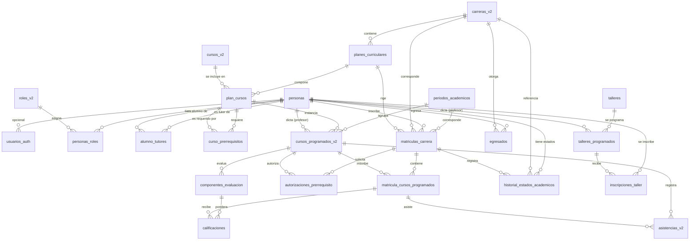

# SICAC — Arquitectura y Modelo de Datos (Rediseño Final)

> **Decisión de nomenclatura (2026-06-28):** se eliminó el sufijo temporal
> `_v2`. Los nombres físicos vigentes son `roles`, `carreras`, `cursos`,
> `cursos_programados` y `asistencias`. Toda referencia histórica a sus
> equivalentes con `_v2` en este documento debe interpretarse con estos nombres.

> **Extensión de importación (2026-06-28):** los alumnos pueden existir antes
> de asignar carrera o plan. Sus datos operativos se almacenan en
> `perfiles_alumno`, una extensión 1:1 de `personas`. Los beneficios son
> categóricos y ya no utilizan porcentajes. La especificación detallada está en
> `docs/student-import-spec.md`.

Este documento describe la arquitectura definitiva del backend y el modelo de base de datos acordado para el **Sistema Integral de Control Académico (SICAC)**, incluyendo las reglas de negocio de las dos carreras (PROFAIC y Actuación), el dominio de talleres, y el flujo completo de identidad, evaluación, asistencia y egreso.

---

## 1. Stack Tecnológico

| Capa        | Tecnología                                                    |
| ----------- | ------------------------------------------------------------- |
| Frontend    | React 18 + Vite + TypeScript + Tailwind CSS + TanStack Query |
| Backend     | Fastify (Node.js) + Drizzle ORM                               |
| Base Datos  | PostgreSQL 15+ (Supabase)                                     |
| Auth        | Supabase Auth (JWT ES256, flujo delegado)                     |
| Infra       | Render (backend) / Vercel o Render (frontend)                 |

---

## 2. Arquitectura del Backend

### Estructura de directorios (`sicac-backend-new/src/`)

```
src/
├── app.ts                          # Composición de Fastify
├── server.ts                       # Entry point
├── config/
│   └── env.ts                      # Variables de entorno tipadas
├── infrastructure/
│   ├── database/
│   │   ├── client.ts               # Pool + Drizzle provider (lazy)
│   │   ├── plugin.ts               # Plugin Fastify (app.db)
│   │   └── schema/
│   │       └── index.ts            # Esquema activo de Drizzle
│   ├── supabase/
│   │   ├── client.ts               # Cliente Supabase
│   │   └── plugin.ts               # Plugin Fastify (app.supabase)
│   └── http/
│       ├── request-auth.ts         # Auth request decorator
│       └── error-handler.ts        # Error handler global
├── modules/
│   ├── identity/
│   │   ├── auth/
│   │   │   ├── routes.ts           # Endpoints de auth (/auth/login, etc.)
│   │   │   └── service.ts          # Lógica de autenticación
│   │   └── repository.ts           # Repositorio de identidad
│   └── system/
│       └── health/
│           └── routes.ts           # Health check endpoints
└── types/
    └── fastify.d.ts                # Tipos de decoradores Fastify
```

### Flujo de autenticación

```
[Cliente] --(DNI + password)--> [POST /auth/login]
                                     │
                                     ▼
                              [Supabase Auth signIn]
                                     │
                                     ▼
                              [Verificación JWT]
                                     │
                                     ▼
                              [Busca identity_profiles.local]
                                     │
                                     ▼
                              [Carga roles asignados]
                                     │
                                     ▼
                              [Inyecta request.user]
```

### Patrón de construcción

- **Composición sobre herencia**: cada módulo expone un `register*` function que recibe el `FastifyInstance` y se registra como plugin.
- **Inyección de dependencias manual**: los repositorios se pasan como opciones, permitiendo mocks en tests.
- **Infrastructure > Modules**: la capa de infraestructura (DB, HTTP, Supabase) es transversal; la lógica de negocio vive en `modules/`.

---

## 3. Modelo de Base de Datos — Rediseño Final

El modelo está dividido en **6 módulos** que reflejan dominios de negocio acotados.

### Diagrama Entidad-Relación (ERD)



### Módulo A — Identidad y Acceso

Tablas base para el modelo de identidad centralizada.

#### `personas`
| Columna            | Tipo         | Descripción                                     |
| ------------------ | ------------ | ----------------------------------------------- |
| `id`               | `uuid` PK    | Identificador único                             |
| `tipo_documento`   | `enum`       | `dni`, `pasaporte`, `carnet_extranjeria`, `otro` |
| `numero_documento` | `varchar(30)`| Número de documento                             |
| `nombres`          | `varchar(150)`| Nombres                                         |
| `apellido_paterno` | `varchar(100)`| Apellido paterno                                |
| `apellido_materno` | `varchar(100)`| Apellido materno (opcional)                     |
| `correo`           | `varchar(255)`| Correo electrónico (opcional)                   |
| `telefono`         | `varchar(30)` | Teléfono (opcional)                             |
| `fecha_nacimiento` | `date`       | Fecha de nacimiento (opcional)                  |
| `estado`           | `enum`       | `activo` / `inactivo`                           |
| `created_at`       | `timestamp`  |                                                   |
| `updated_at`       | `timestamp`  |                                                   |
| `created_by`       | `uuid`       | Auditoría                                       |
| `updated_by`       | `uuid`       | Auditoría                                       |

**Unique**: `(tipo_documento, numero_documento)`

#### `usuarios_auth`
| Columna               | Tipo          | Descripción                                    |
| --------------------- | ------------- | ---------------------------------------------- |
| `id`                  | `uuid` PK     |                                                 |
| `persona_id`          | `uuid` FK     | Referencia a `personas.id` (unique)             |
| `username`            | `varchar(60)` | Nombre de usuario (unique)                      |
| `auth_provider_user_id` | `uuid`      | ID del usuario en Supabase Auth (opcional)      |
| `estado_acceso`       | `enum`        | `activo` / `inactivo`                          |
| `ultimo_acceso_at`    | `timestamp`   | Último inicio de sesión                        |
| `created_at`          | `timestamp`   |                                                 |
| `updated_at`          | `timestamp`   |                                                 |

**Reglas**:
- Una persona puede existir **sin** usuario (ej. niños PROFAIC, externos de talleres).
- Una persona tiene **como máximo un** usuario de acceso.

#### `roles_v2`
| Columna      | Tipo           | Descripción                      |
| ------------ | -------------- | -------------------------------- |
| `id`         | `uuid` PK      |                                   |
| `codigo`     | `varchar(60)`  | Código máquina (`ADMIN`, `PROFESOR`, etc.) |
| `nombre`     | `varchar(120)` | Nombre legible                   |
| `descripcion`| `text`         |                                   |
| `estado`     | `enum`         | `activo` / `inactivo`            |

**Roles operativos**: `ADMINISTRADOR_SISTEMA`, `DIRECTOR_ACADEMICO`, `GESTOR_ACADEMICO`, `PROFESOR`, `ALUMNO`.

#### `personas_roles`
| Columna      | Tipo      | Descripción                                |
| ------------ | --------- | ------------------------------------------ |
| `persona_id` | `uuid` FK |                                             |
| `rol_id`     | `uuid` FK |                                             |
| `estado`     | `enum`    | `activo` / `inactivo`                      |
| `fecha_inicio`| `date`   | Inicio de vigencia                         |
| `fecha_fin`  | `date`    | Fin de vigencia (null = vigente)            |
| `observacion`| `text`    |                                             |

**PK compuesto**: `(persona_id, rol_id, fecha_inicio)`

**Reglas**:
- Un alumno egresado NO se representa como rol, sino como condición académica (ver `egresados`).
- `alumni` no es un rol, es un estado académico alcanzado.

#### `alumno_tutores`
| Columna            | Tipo      | Descripción                        |
| ------------------ | --------- | ---------------------------------- |
| `id`               | `uuid` PK |                                     |
| `alumno_persona_id`| `uuid` FK | Referencia a `personas.id`          |
| `tutor_persona_id` | `uuid` FK | Referencia a `personas.id`          |
| `tipo_relacion`    | `varchar` | Ej: `padre`, `madre`, `apoderado`  |
| `estado`           | `enum`    | `activo` / `inactivo`              |
| `fecha_inicio`     | `date`    |                                     |
| `fecha_fin`        | `date`    |                                     |

**Reglas**:
- Máximo **2 tutores activos** por alumno (validación en aplicación).
- Una persona puede ser tutor de múltiples alumnos.

---

### Módulo B — Estructura Académica

#### `carreras_v2`
| Columna      | Tipo           | Descripción              |
| ------------ | -------------- | ------------------------ |
| `id`         | `uuid` PK      |                           |
| `codigo`     | `varchar(30)`  | Código único              |
| `nombre`     | `varchar(150)` | Nombre de la carrera      |
| `descripcion`| `text`         |                           |
| `estado`     | `enum`         | `activo` / `inactivo`    |

**Carreras actuales**: `PROFAIC` (niños 8-16 años), `ACTUACION` (jóvenes y adultos).

#### `planes_curriculares`
| Columna      | Tipo           | Descripción                        |
| ------------ | -------------- | ---------------------------------- |
| `id`         | `uuid` PK      |                                     |
| `carrera_id` | `uuid` FK      | Referencia a `carreras_v2.id`       |
| `codigo`     | `varchar(30)`  | Código del plan                     |
| `nombre`     | `varchar(150)` | Nombre del plan                     |
| `version`    | `varchar(30)`  | Versión (ej. `2024`, `2025-1`)      |
| `estado`     | `enum`         | `activo` / `inactivo`              |

**Unique**: `(carrera_id, codigo, version)`

#### `cursos_v2`
| Columna      | Tipo           | Descripción              |
| ------------ | -------------- | ------------------------ |
| `id`         | `uuid` PK      |                           |
| `codigo`     | `varchar(30)`  | Código único              |
| `nombre`     | `varchar(150)` | Nombre del curso          |
| `descripcion`| `text`         |                           |
| `estado`     | `enum`         | `activo` / `inactivo`    |

#### `plan_cursos`
| Columna             | Tipo      | Descripción                              |
| ------------------- | --------- | ---------------------------------------- |
| `id`                | `uuid` PK |                                           |
| `plan_curricular_id`| `uuid` FK |                                           |
| `curso_id`          | `uuid` FK |                                           |
| `ciclo`             | `integer` | Número de ciclo/semestre                 |
| `orden`             | `integer` | Orden dentro del ciclo                   |
| `estado`            | `enum`    | `activo` / `inactivo`                    |

**Unique**: `(plan_curricular_id, curso_id)`

#### `curso_prerrequisitos`
| Columna                | Tipo      | Descripción                              |
| ---------------------- | --------- | ---------------------------------------- |
| `id`                   | `uuid` PK |                                           |
| `plan_curso_id`        | `uuid` FK | Curso que requiere prerrequisito          |
| `curso_prerrequisito_id` | `uuid` FK | Curso que es prerrequisito              |

**Reglas**:
- No auto-referencia (`plan_curso_id != curso_prerrequisito_id`).
- La detección de ciclos en el grafo de prerrequisitos se valida en aplicación.

#### `periodos_academicos`
| Columna      | Tipo      | Descripción                          |
| ------------ | --------- | ------------------------------------ |
| `id`         | `uuid` PK |                                       |
| `codigo`     | `varchar` | Código único                          |
| `nombre`     | `varchar` | Ej: "2025-I", "2025-II", "2025-III" |
| `fecha_inicio`| `date`   |                                       |
| `fecha_fin`  | `date`    |                                       |
| `estado`     | `enum`    | `activo` / `inactivo`                |

**Regla**: `fecha_fin >= fecha_inicio`

---

### Módulo C — Operación Académica

#### `matriculas_carrera`
| Columna                | Tipo         | Descripción                              |
| ---------------------- | ------------ | ---------------------------------------- |
| `id`                   | `uuid` PK    |                                           |
| `persona_id`           | `uuid` FK    |                                           |
| `carrera_id`           | `uuid` FK    |                                           |
| `plan_curricular_id`   | `uuid` FK    | Plan bajo el cual se matricula           |
| `periodo_academico_id` | `uuid` FK    | Periodo de ingreso                       |
| `estado`               | `enum`       | `activo` / `retirado` / `completado` / `anulado` |
| `fecha_matricula`      | `date`       |                                           |
| `tipo_beneficio`       | `enum`       | `credito` / `beca` (opcional)             |
| `porcentaje_beneficio` | `integer`    | `25`, `50` o `100` (si hay beneficio)     |
| `observacion_beneficio`| `text`       |                                           |
| `snapshot_carrera_nombre` | `varchar` | Snapshot del nombre de la carrera         |
| `snapshot_plan_nombre` | `varchar`    | Snapshot del nombre del plan              |
| `snapshot_costo`       | `numeric`    | Snapshot del costo                        |

**Reglas**:
- El beneficio solo acepta valores `25`, `50` o `100` cuando está presente.
- Los snapshots preservan el valor histórico si el catálogo cambia.

#### `cursos_programados_v2`
| Columna             | Tipo      | Descripción                              |
| ------------------- | --------- | ---------------------------------------- |
| `id`                | `uuid` PK |                                           |
| `plan_curso_id`     | `uuid` FK | Referencia al curso en el plan           |
| `periodo_academico_id`| `uuid` FK| Periodo en que se dicta                  |
| `profesor_persona_id`| `uuid` FK| Docente asignado                         |
| `seccion`           | `varchar` | Sección/grupo (ej: "A", "B")             |
| `estado`            | `enum`    | `activo` / `inactivo`                    |

**Unique**: `(plan_curso_id, periodo_academico_id, seccion)`

#### `matricula_cursos_programados`
| Columna              | Tipo      | Descripción                              |
| -------------------- | --------- | ---------------------------------------- |
| `id`                 | `uuid` PK |                                           |
| `matricula_carrera_id`| `uuid` FK|                                           |
| `curso_programado_id`| `uuid` FK |                                           |
| `estado`             | `enum`    | `activo` / `retirado` / `completado` / `anulado` |
| `fecha_inscripcion`  | `date`    |                                           |

**Unique**: `(matricula_carrera_id, curso_programado_id)`

#### `autorizaciones_prerrequisito`
| Columna                | Tipo      | Descripción                              |
| ---------------------- | --------- | ---------------------------------------- |
| `id`                   | `uuid` PK |                                           |
| `matricula_carrera_id` | `uuid` FK |                                           |
| `curso_programado_id`  | `uuid` FK | Curso al que se autoriza                 |
| `motivo`               | `text`    | Justificación                            |
| `aprobado_por_persona_id` | `uuid` FK | Debe tener rol `DIRECTOR_ACADEMICO`    |
| `fecha_aprobacion`     | `timestamp`|                                           |
| `estado`               | `enum`    | `pendiente` / `aprobada` / `rechazada`  |

---

### Módulo D — Evaluación y Asistencia

#### `componentes_evaluacion`
| Columna              | Tipo          | Descripción                          |
| -------------------- | ------------- | ------------------------------------ |
| `id`                 | `uuid` PK     |                                       |
| `curso_programado_id`| `uuid` FK     | Curso al que pertenece                |
| `nombre`             | `varchar(100)`| Ej: "Práctica", "Examen Parcial"      |
| `porcentaje`         | `numeric(5,2)`| Peso porcentual (suma debe dar 100)   |
| `orden`              | `integer`     | Orden de evaluación                   |

**Reglas**:
- La suma de porcentajes por `curso_programado_id` debe ser **exactamente 100** (validación en aplicación).
- Cada porcentaje debe ser **> 0**.

#### `calificaciones`
| Columna                       | Tipo          | Descripción                          |
| ----------------------------- | ------------- | ------------------------------------ |
| `id`                          | `uuid` PK     |                                       |
| `componente_evaluacion_id`    | `uuid` FK     |                                       |
| `matricula_curso_programado_id` | `uuid` FK   |                                       |
| `nota`                        | `numeric(5,2)`| Nota en escala 0-20                   |
| `observacion`                 | `text`        |                                       |
| `registrado_por`              | `uuid` FK     | Persona que registró                  |

**Unique**: `(componente_evaluacion_id, matricula_curso_programado_id)`

**Reglas**:
- Nota mínima aprobatoria: **11**.
- Para Actuación, las notas 0-20 se convierten a letras: **A** (17-20), **B** (14-16), **C** (11-13), **D** (0-10).
- El **primer intento aprobatorio** es el que cuenta para prerrequisitos y finalización del plan.
- Los retiros (retakes) **no sobrescriben** notas históricas.

#### `asistencias_v2`
| Columna                       | Tipo      | Descripción                          |
| ----------------------------- | --------- | ------------------------------------ |
| `id`                          | `uuid` PK |                                       |
| `curso_programado_id`         | `uuid` FK |                                       |
| `matricula_curso_programado_id`| `uuid` FK|                                       |
| `fecha`                       | `date`    | Fecha de la sesión                    |
| `estado_asistencia`           | `enum`    | `presente` / `tardanza` / `falta` / `justificada` |
| `registrado_por`              | `uuid` FK |                                       |

**Unique**: `(matricula_curso_programado_id, fecha)`

**Reglas de negocio (aplicación)**:
| Condición                     | Acción                        |
| ----------------------------- | ----------------------------- |
| **3 faltas**                  | Retiro automático del curso   |
| **9 tardanzas**               | Retiro automático del curso   |
| **3 tardanzas**               | Equivalen a **1 falta**       |
| Umbral de alerta (próximo a inhabilitar) | Notificar al profesor |

---

### Módulo E — Ciclo de Vida Académico y Egreso

#### `historial_estados_academicos`
| Columna              | Tipo      | Descripción                              |
| -------------------- | --------- | ---------------------------------------- |
| `id`                 | `uuid` PK |                                           |
| `persona_id`         | `uuid` FK |                                           |
| `carrera_id`         | `uuid` FK | (opcional, null para talleres)            |
| `matricula_carrera_id`| `uuid` FK| (opcional)                                |
| `estado_academico`   | `enum`    | `activo` / `retirado` / `egresado`       |
| `fecha_inicio`       | `date`    |                                           |
| `fecha_fin`          | `date`    | Null si es el estado actual               |
| `motivo`             | `text`    |                                           |
| `registrado_por`     | `uuid` FK |                                           |

**Estados académicos durables**:
- `activo` — Estudiante cursando regularmente.
- `retirado` — Abandono o retiro.
- `egresado` — Graduado oficialmente.

`reinscrito` **no es un estado durable**. Es una razón de transición que abre un nuevo estado `activo`.

#### `egresados`
| Columna                | Tipo          | Descripción                          |
| ---------------------- | ------------- | ------------------------------------ |
| `id`                   | `uuid` PK     |                                       |
| `persona_id`           | `uuid` FK     |                                       |
| `carrera_id`           | `uuid` FK     |                                       |
| `codigo_egresado`      | `varchar(40)` | Código global secuencial (`CAC-XXX`) |
| `promocion`            | `varchar(50)` |                                       |
| `anio_egreso`          | `integer`     |                                       |
| `fecha_egreso`         | `date`        |                                       |
| `aprobado_por_persona_id`| `uuid` FK   | Debe tener rol `DIRECTOR_ACADEMICO`   |

**Reglas**:
- La elegibilidad para egreso puede ser **calculada automáticamente**.
- El egreso oficial requiere **aprobación manual explícita** por alguien con rol `DIRECTOR_ACADEMICO`.
- `codigo_egresado` es global y secuencial a nivel institucional.
- Si un egresado toma cursos de reforzamiento, se reutiliza la `matricula_carrera` original y la condición de egresado se mantiene.

---

### Módulo F — Talleres (Extracurricular)

#### `talleres`
| Columna      | Tipo           | Descripción              |
| ------------ | -------------- | ------------------------ |
| `id`         | `uuid` PK      |                           |
| `codigo`     | `varchar(30)`  | Código único              |
| `nombre`     | `varchar(150)` |                           |
| `descripcion`| `text`         |                           |
| `estado`     | `enum`         | `activo` / `inactivo`    |

#### `talleres_programados`
| Columna              | Tipo          | Descripción                          |
| -------------------- | ------------- | ------------------------------------ |
| `id`                 | `uuid` PK     |                                       |
| `taller_id`          | `uuid` FK     |                                       |
| `profesor_persona_id`| `uuid` FK     | Opcional                              |
| `fecha_inicio`       | `date`        |                                       |
| `fecha_fin`          | `date`        |                                       |
| `costo`              | `numeric`     | Opcional                              |
| `estado`             | `enum`        | `activo` / `inactivo`                |

#### `inscripciones_taller`
| Columna              | Tipo          | Descripción                          |
| -------------------- | ------------- | ------------------------------------ |
| `id`                 | `uuid` PK     |                                       |
| `persona_id`         | `uuid` FK     |                                       |
| `taller_programado_id`| `uuid` FK    |                                       |
| `estado`             | `enum`        | `activo` / `retirado` / `completado` |
| `fecha_inscripcion`  | `date`        |                                       |
| `snapshot_taller_nombre`| `varchar`  | Snapshot del nombre del taller        |
| `snapshot_costo`     | `numeric`     | Snapshot del costo                    |

**Reglas**:
- Los talleres aceptan **personas existentes** y **externos nuevos** (sin acceso al sistema).
- Si un externo luego ingresa a un programa formal, se reutiliza la misma identidad.
- Los talleres **no** comparten lógica de prerrequisitos ni planes de estudio con carreras.
- Los talleres **no** tienen notas ni evaluaciones, solo registro de participación.

---

## 4. Reglas de Negocio por Carrera

### PROFAIC (Niños 8-16 años)
| Aspecto              | Regla                                       |
| -------------------- | ------------------------------------------- |
| Acceso al sistema    | Sin usuario. Los niños NO acceden al sistema. |
| Representación       | Datos de la persona + datos del apoderado (tutor). |
| Evaluación           | Sin notas numéricas. Solo estado: `aprobó` o `retirado`. |
| Estructura           | Niveles I y II, con grupos por edad.        |
| Beneficios           | Aplica crédito/beca 25/50/100%.             |

### Actuación (Jóvenes y Adultos)
| Aspecto              | Regla                                       |
| -------------------- | ------------------------------------------- |
| Acceso al sistema    | Usuario generado: 2 letras nombre + 2 apellido = 6 caracteres. |
| Estructura           | 4 ciclos, 3 periodos por año.               |
| Cursos               | En cadena con prerrequisitos.                |
| Evaluación           | Notas 0-20 convertidas a letras: **A**(17-20), **B**(14-16), **C**(11-13), **D**(0-10). |
| Aprobación           | Mínimo 11. Primer intento aprobatorio es el que cuenta. |
| Asistencia           | 3 faltas = retiro. 9 tardanzas = retiro. 3 tardanzas = 1 falta. |
| Beneficios           | Aplica crédito/beca 25/50/100%.             |

---

## 5. Patrones Arquitectónicos

### 5.1 Identidad Centralizada vs RBAC Contextual
No existen tablas físicas `alumnos` o `profesores`. La tabla `personas` es única. El "estado" (ej: Graduado) depende de la condición académica (`historial_estados_academicos`, `egresados`), no de la persona. Esto permite que una persona sea Estudiante y Docente simultáneamente.

### 5.2 Patrón Catálogo/Instancia (Snapshot)
Las tablas de catálogo (`carreras_v2`, `cursos_v2`, `talleres`) son la definición canónica. Al crear instancias operativas (`matriculas_carrera`, `inscripciones_taller`), se copian los datos críticos como snapshot (nombre, costo). Si el catálogo cambia en el futuro, el historial pasado no se corrompe.

### 5.3 Auditoría en Todas las Tablas
Toda tabla transaccional incluye:
- `created_at` / `updated_at` — marcas de tiempo
- `created_by` / `updated_by` — UUID de la persona que realizó el cambio

### 5.4 Separación Persona vs Usuario
Una persona puede existir **sin** acceso al sistema. El acceso es opcional y se modela en `usuarios_auth`. Esto permite:
- Niños PROFAIC sin usuario
- Externos de talleres sin usuario
- Una misma persona conserva su identidad a través de todas sus transiciones académicas

---

## 6. Estrategia de Migración (Del esquema legacy al rediseño)

### Fase 1 — Schema aditivo (completado)
- Schema nuevo en paralelo (`schema-redesign.ts`).
- Tablas legacy NO eliminadas.

### Fase 2 — Migración de identidad (en progreso)
- Mapear `usuarios` → `personas`.
- Separar concernimientos de auth en `usuarios_auth`.
- Migrar `usuario_roles` → `personas_roles`.

### Fase 3 — Migración académica (pendiente)
- Mapear `carreras`, `cursos_base`, `malla_curricular` al nuevo modelo.
- Migrar matrículas, evaluaciones y asistencias.

### Fase 4 — Ciclo de vida y egreso (pendiente)
- Crear `historial_estados_academicos`.
- Flujo de aprobación de egreso + `egresados`.

### Fase 5 — Talleres (pendiente)
- Flujos específicos de talleres después de estabilizar el dominio de carreras.

---

## 7. Próximos Pasos — Lógica de Negocio Pendiente

La implementación actual (`sicac-backend-new`) tiene la infraestructura base lista:
- ✅ Conexión a base de datos + Drizzle provider
- ✅ Plugin de autenticación Supabase
- ✅ Identity profiles + roles + role assignments
- ✅ Health check endpoints
- ✅ Auth routes (login DNI bridge)

**Lo que falta implementar en `sicac-backend-new`**:

1. **Schema académico completo**: migrar las tablas de `schema-redesign.ts` (Módulos B, C, D, E, F).
2. **Servicios de negocio**:
   - Matrícula con control de concurrencia
   - Validación de prerrequisitos
   - Registro de evaluaciones y cálculo de promedios
   - Control de asistencia con reglas de faltas/tardanzas
   - Flujo de egreso con aprobación
3. **Endpoints REST** para cada dominio académico.
4. **Pruebas** unitarias y de integración.
